# 🚀 Quick Docker Deployment Reference

## ✅ What You Asked: "Do I need to install packages in GitHub Actions?"

### **Answer: NO! ❌**

**All package installation happens INSIDE the Dockerfile during the Docker build process.**

The GitHub Action only runs `docker build`, which executes these steps automatically:

```dockerfile
# Stage 1: Builder (inside Docker)
RUN composer install --no-dev --optimize-autoloader  # ✅ PHP packages installed here
RUN npm ci                                            # ✅ Node packages installed here
RUN npm run build                                     # ✅ Assets compiled here
```

### What the GitHub Action Does

```yaml
# .github/workflows/docker-publish.yml
steps:
  - Checkout code                    # ✅ Gets your source code
  - Setup Docker Buildx              # ✅ Prepares Docker builder
  - Login to GHCR                    # ✅ Authenticates with GitHub
  - Build and push image             # ✅ Runs: docker build + docker push
```

**The Action does NOT run:**
- ❌ `composer install`
- ❌ `npm install`
- ❌ `npm run build`

**These commands run INSIDE the Docker container during the build.**

---

## 📦 Files Created

| File | Purpose |
|------|---------|
| `Dockerfile` | Multi-stage build with all dependencies |
| `.dockerignore` | Excludes unnecessary files from image |
| `.github/workflows/docker-publish.yml` | Auto-builds and pushes to GHCR |
| `DOCKER_DEPLOYMENT.md` | Full deployment guide |
| `routes/web.php` | Added `/api/health` endpoint |
| `octane-supervisor.conf` | Updated to run as `www-data` |

---

## 🎯 Quick Commands

### Local Development
```bash
# Build and start
docker-compose up -d

# View logs
docker logs -f sanago-octane

# Run migrations
docker exec sanago-octane php artisan migrate

# Access shell
docker exec -it sanago-octane bash
```

### Production (GHCR)
```bash
# Pull latest image
docker pull ghcr.io/your-username/sanago-v1:latest

# Run container
docker run -d \
  -p 8000:8000 \
  -e APP_KEY=your-key \
  -e DB_HOST=your-db \
  ghcr.io/your-username/sanago-v1:latest

# Or use docker-compose
# (Edit docker-compose.yml to uncomment the 'image:' line)
docker-compose up -d
```

---

## 🔄 Deployment Workflow

```mermaid
graph LR
    A[Push to GitHub] --> B[GitHub Action Triggers]
    B --> C[Checkout Code]
    C --> D[Docker Build]
    D --> E[Install Composer Packages]
    E --> F[Install NPM Packages]
    F --> G[Build Vite Assets]
    G --> H[Create Production Image]
    H --> I[Push to GHCR]
    I --> J[Deploy to Server]
```



1. **You push code** to `main` branch
2. **GitHub Action runs** automatically
3. **Docker builds image** (installs all packages inside)
4. **Image pushed** to `ghcr.io/your-username/sanago-v1:latest`
5. **You pull and deploy** the image anywhere

---

## 🎨 Image Tags Explained

When you push to GitHub, these tags are created automatically:

| Tag | When Created | Example |
|-----|--------------|---------|
| `latest` | Every push to `main` | `ghcr.io/user/sanago-v1:latest` |
| `main-<sha>` | Every commit on `main` | `ghcr.io/user/sanago-v1:main-abc1234` |
| `v1.0.0` | When you create a tag | `ghcr.io/user/sanago-v1:v1.0.0` |
| `1.0` | Semantic version | `ghcr.io/user/sanago-v1:1.0` |
| `1` | Major version | `ghcr.io/user/sanago-v1:1` |

**Recommendation:** Use specific versions in production, not `latest`.

---

## 🔐 Security Checklist

- ✅ Container runs as `www-data` (non-root)
- ✅ `.env` excluded via `.dockerignore`
- ✅ Multi-stage build (smaller image)
- ✅ OPcache enabled for production
- ✅ Health check endpoint added
- ✅ Supervisor manages processes
- ✅ Secrets passed as environment variables

---

## 🐛 Common Issues

### "Permission denied" errors
```bash
docker exec sanago-octane chown -R www-data:www-data /app/storage /app/bootstrap/cache
```

### Assets not loading
```bash
# Rebuild image
docker-compose build --no-cache
```

### Queue workers not running
```bash
# Check supervisor
docker exec sanago-octane supervisorctl status

# Restart workers
docker exec sanago-octane supervisorctl restart worker:*
```

### Can't pull from GHCR
```bash
# Login with GitHub token
echo $GITHUB_TOKEN | docker login ghcr.io -u USERNAME --password-stdin
```

---

## 📊 Image Size

| Stage | Size | Contains |
|-------|------|----------|
| Builder | ~2.1 GB | Source + dependencies + build tools |
| **Final** | **~800 MB** | **Compiled app + runtime only** |

**Savings: 62% smaller image!**

---

## 🎓 Key Concepts

### Multi-Stage Build
- **Stage 1 (Builder):** Installs everything, compiles assets
- **Stage 2 (Runtime):** Copies only the compiled app

### Why This Matters
- ✅ Smaller images (faster deploys)
- ✅ No build tools in production (more secure)
- ✅ Consistent builds (same result every time)

### Docker Layer Caching
The Dockerfile is optimized to cache layers:

```dockerfile
# These rarely change → cached
COPY composer.json composer.lock ./
RUN composer install

# These change often → rebuilt
COPY . .
RUN npm run build
```

---

## 🚀 Next Steps

1. **Push to GitHub** - The Action will auto-build
2. **Check Actions tab** - Watch the build progress
3. **Pull the image** - Use in production
4. **Deploy** - Docker Compose, Kubernetes, or cloud platform

---

## 📚 Learn More

- Full guide: `DOCKER_DEPLOYMENT.md`
- Dockerfile: `Dockerfile`
- GitHub Action: `.github/workflows/docker-publish.yml`

---

**Questions?** Check the troubleshooting section in `DOCKER_DEPLOYMENT.md`
